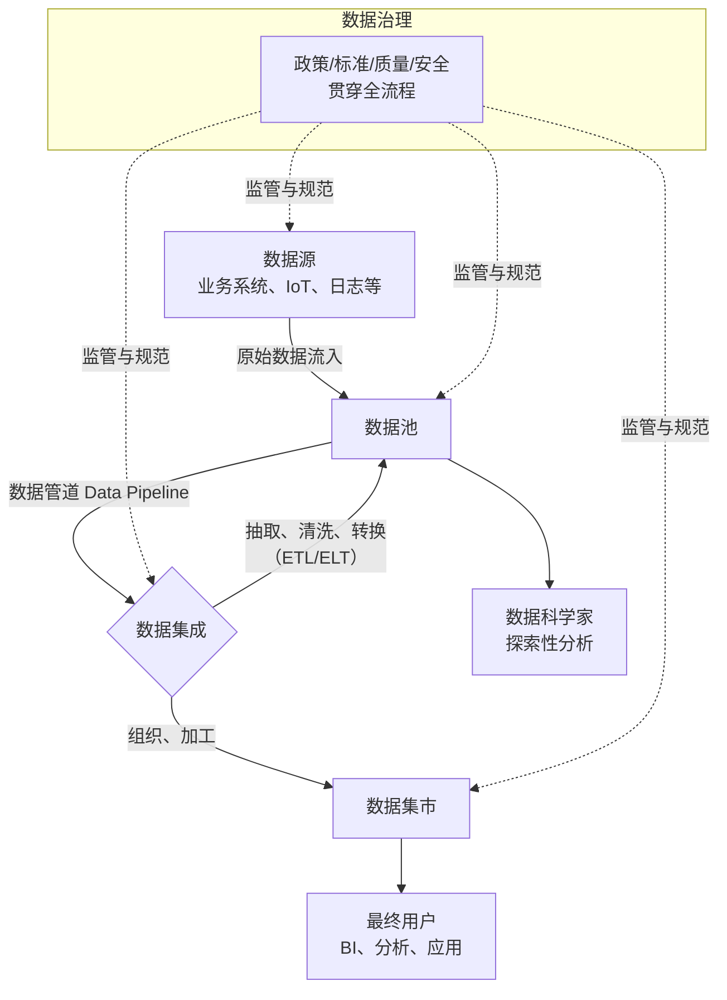
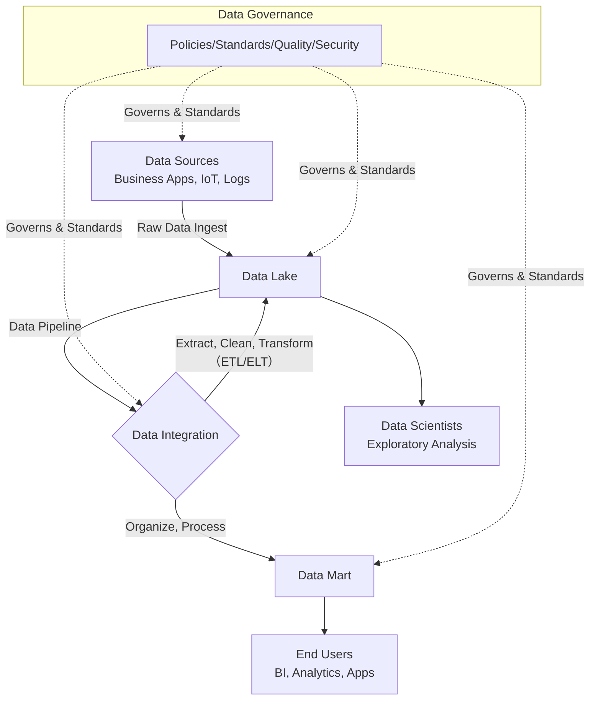

Notice：从Blog进入可能无法正常显示流程图，可以跳转Github或者在评论区查看，本人正在积极解决该问题
##### Chinese Version

```mermaid
flowchart TD
    A[数据源<br>业务系统、IoT、日志等] -->|原始数据流入| B[数据池 ]

    subgraph Governance [数据治理 ]
        G[政策/标准/质量/安全<br>贯穿全流程]
    end

    B -- 数据管道 Data Pipeline --> C{数据集成<br>}
    C -- 抽取、清洗、转换<br>（ETL/ELT） --> B
    C -- 组织、加工 --> D[数据集市 ]

    D --> E[最终用户<br>BI、分析、应用]
    B --> F[数据科学家<br>探索性分析]

    G -.->|监管与规范| A
    G -.->|监管与规范| B
    G -.->|监管与规范| C
    G -.->|监管与规范| D
```
##### English Version

```mermaid
flowchart TD
    A[Data Sources<br>Business Apps, IoT, Logs] -->|Raw Data Ingest| B[Data Lake]

    subgraph Governance [Data Governance<br>Governs Entire Process]
        G[Policies/Standards/Quality/Security]
    end

    B -- Data Pipeline --> C{Data Integration}
    C -- Extract, Clean, Transform<br>（ETL/ELT） --> B
    C -- Organize, Process --> D[Data Mart]

    D --> E[End Users<br>BI, Analytics, Apps]
    B --> F[Data Scientists<br>Exploratory Analysis]

    G -.->|Governs & Standards| A
    G -.->|Governs & Standards| B
    G -.->|Governs & Standards| C
    G -.->|Governs & Standards| D
```